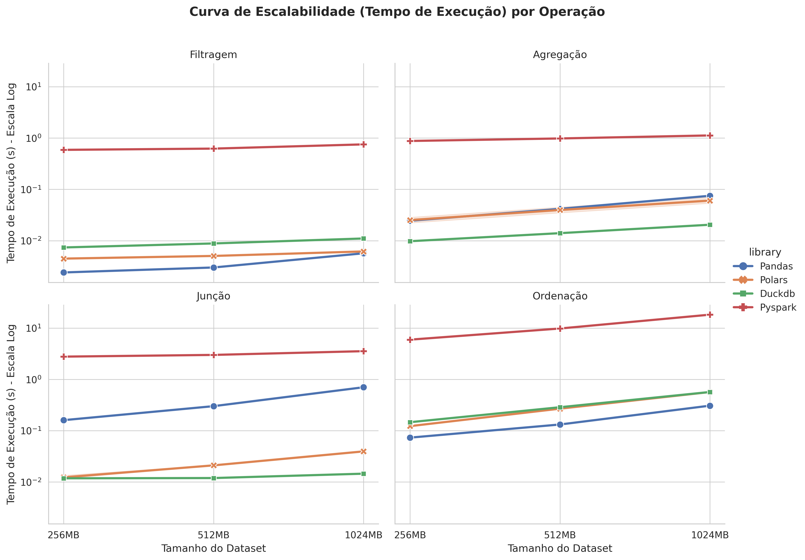
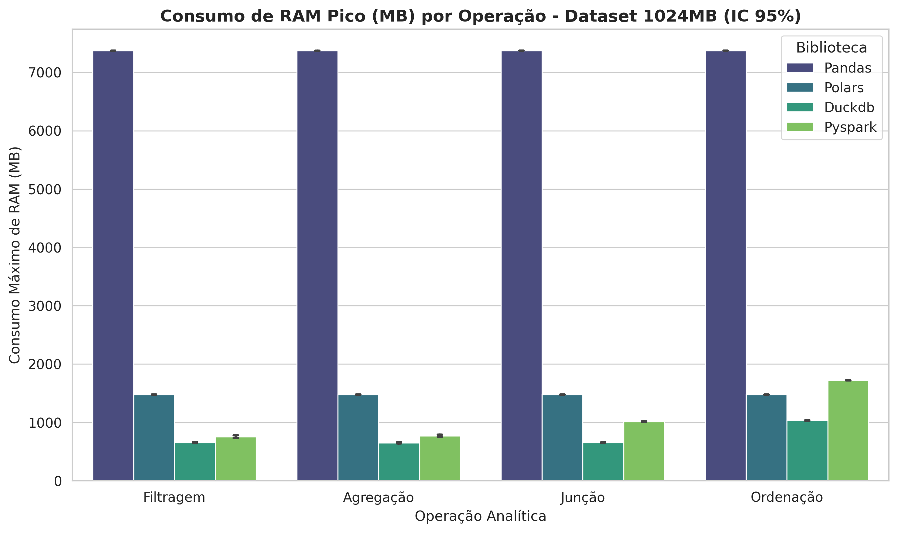
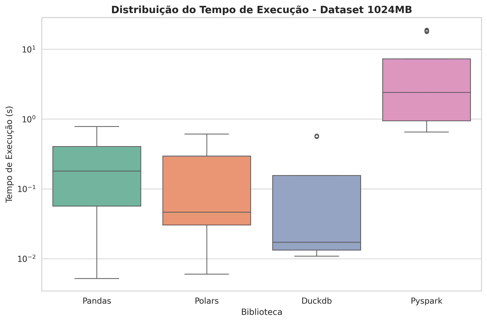

# Avaliação de Desempenho de Bibliotecas

Este projeto tem como objetivo realizar a avaliação e comparação de desempenho de diferentes bibliotecas de processamento e manipulação de dados em Python, como **Pandas**, **Polars**, **DuckDB** e **Apache Spark**.

## Principais Resultados do Benchmark

O estudo avaliou o desempenho das quatro bibliotecas executando operações analíticas fundamentais (filtragem, agregação, junção e ordenação) em conjuntos de dados de 256MB, 512MB e 1GB em uma máquina local com hardware limitado (8GB de RAM). Os resultados medidos revelaram conclusões fundamentais sobre o perfil de cada biblioteca:

| Biblioteca | Tempo Médio (s) | Pico de RAM (1GB) | Escalabilidade | Melhor Caso de Uso |
| :--- | :--- | :--- | :--- | :--- |
| **DuckDB** | **Excelente** (Subsegundo / ms) | **Mínimo** (~620 MB) | Excepcional (Linear / *spill-to-disk*) | Análises analíticas embarcadas e computação limitada |
| **Polars** | **Excelente** (Subsegundo / ms) | Baixo (~1.500 MB) | Excepcional (Rust-powered multi-threaded) | Engenharia de dados local de alta velocidade |
| **Pandas** | Moderado (Baixo em Junções) | **Crítico** (~7.400 MB) | Crítico (Em memória, alto risco de OOM) | Análises exploratórias e volumes pequenos ($<256$MB) |
| **Spark** | Muito Baixo (JVM local local) | Moderado (700-1.700 MB) | Moderado (JVM local / *cold start*) | Processamento distribuído em clusters reais (Big Data) |

### Destaques das Métricas:
* **Consumo Crítico de RAM do Pandas:** Para processar 1GB de dados, o Pandas consome cerca de **7,4 GB (93% da memória total disponível)**, colocando o fluxo à beira de falhas por falta de memória (OOM).
* **Supremacia do DuckDB:** O DuckDB consome **menos de 9% da RAM** demandada pelo Pandas, resultado de sua execução vetorizada e descarregamento dinâmico em disco (*spill-to-disk*).
* **Velocidade de Polars e DuckDB:** Em junções complexas com 1GB, Polars e DuckDB processam dados em **0,01s**, superando o Pandas em até **80 vezes**.
* **Overhead da JVM no PySpark:** O PySpark local levou até **20s** em ordenações, mostrando-se ineficiente para nó único devido ao custo de runtime Java e serialização.

Os gráficos em alta resolução detalhando estes resultados estão salvos na pasta `/assets` e podem ser visualizados diretamente abaixo:

### Curva de Escalabilidade Temporal (Tempo de Execução por Operação)

### Pico de Consumo de RAM por Operação (Dataset de 1GB)

### Boxplot de Dispersão e Estabilidade (Dataset de 1GB)

---