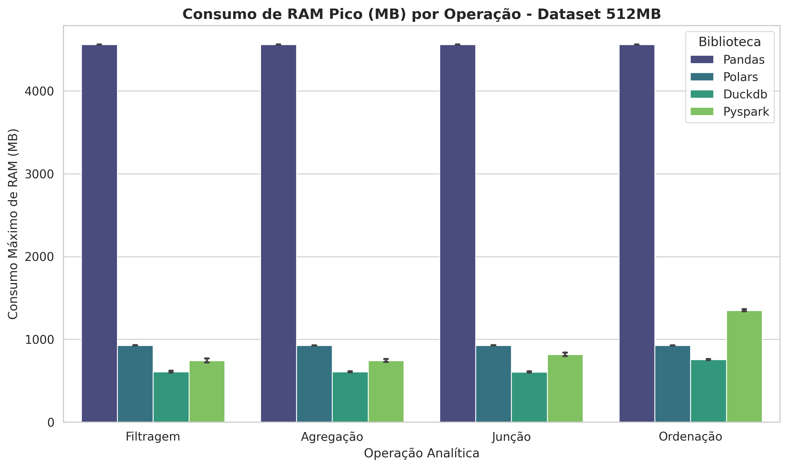
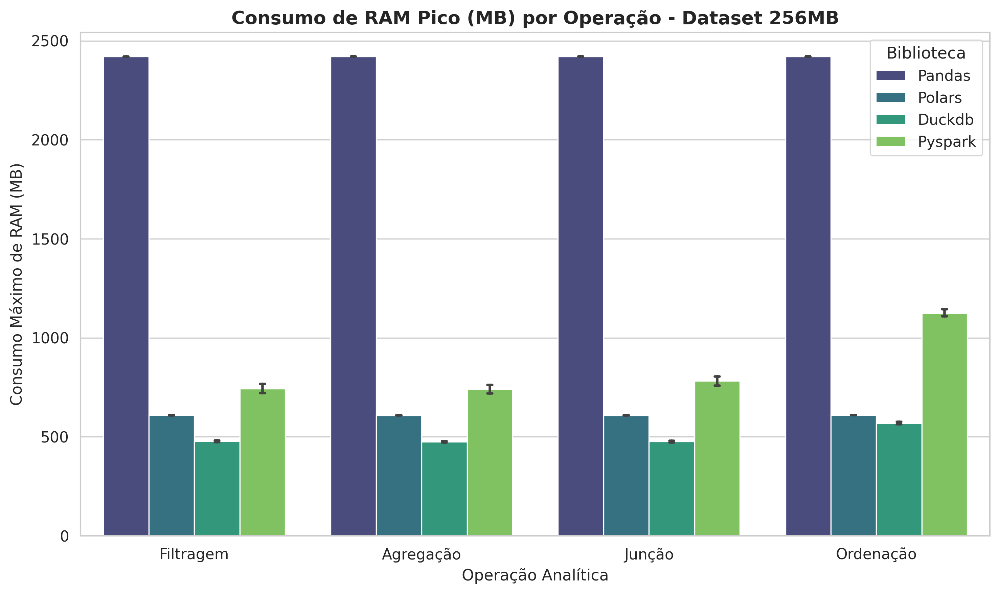

# Avaliação de Desempenho de Bibliotecas de Processamento de Dados em Ambiente com Recursos Limitados

📄 **Artigo Científico Completo (PDF):** [artigo/avaliação_desempenho_libs.pdf](artigo/avaliação_desempenho_libs.pdf)

Este repositório contém o código-fonte, a metodologia e os resultados do benchmark comparativo de desempenho entre quatro das principais bibliotecas de manipulação de dados em Python: **Pandas**, **Polars**, **DuckDB** e **Apache Spark (PySpark)**, em um ambiente computacional com recursos de hardware limitados.

---

## 📌 Introdução

O processamento e a manipulação de dados desempenham um papel fundamental na ciência de dados e na engenharia de dados, envolvendo etapas como limpeza, filtragem, transformação, agregação e ordenação de conjuntos de dados. Conforme os volumes de dados crescem e a complexidade das análises aumenta, a escolha da ferramenta de processamento exerce um impacto direto no tempo de execução, na eficiência computacional e no consumo de memória RAM.

### O Desafio dos Ambientes com Recursos Limitados
Em muitos cenários práticos — como desenvolvimento local em notebooks modestos, dispositivos de borda (*edge computing*) ou instâncias em nuvem de baixo custo —, a escassez de memória RAM e capacidade de processamento representa um grande desafio. Ferramentas tradicionais que operam estritamente em memória (*in-memory*) podem esgotar rapidamente os recursos físicos disponíveis, resultando em degradação extrema do sistema ou falhas catastróficas por falta de memória (**Out-Of-Memory - OOM**).

### Objetivos e Contribuições do Estudo
Este trabalho realiza uma avaliação experimental sistemática e quantitativa das bibliotecas Pandas, Polars, DuckDB e PySpark. As principais contribuições incluem:
- **Planejamento Fatorial Completo:** Avaliação abrangente em ambiente isolado sob limitações reais de hardware.
- **Métricas de Precisão:** Quantificação direta do tempo de execução analítico e do pico de consumo de memória física (RAM/RSS) em três escalas volumétricas (256MB, 512MB e 1GB).
- **Análise Arquitetural:** Identificação dos *trade-offs* entre simplicidade de uso, processamento vetorizado, avaliação preguiçosa (*lazy evaluation*), gerenciamento *spill-to-disk* e overhead distribuído (JVM).

---

## ⚙️ Ambiente de Hardware e Software

Para minimizar o ruído computacional de fundo e garantir medições reproduzíveis, os experimentos foram executados em um ambiente minimalista dedicado com as seguintes especificações:

| Componente | Especificação |
| :--- | :--- |
| **Dispositivo** | Notebook Dell Inspiron 15-3583 |
| **Processador (CPU)** | Intel® Core™ i7-8565U (8ª geração, 4 núcleos / 8 threads) |
| **Memória RAM** | 8 GB DDR4 @ 2400 MHz (1x SODIMM) |
| **Armazenamento** | SSD NVMe M.2 PCIe de 256 GB |
| **Placa Gráfica** | Intel® UHD Graphics 620 (Integrada) |
| **Sistema Operacional** | Arch Linux (versão minimal, sem interface gráfica/GUI para evitar consumo secundário de RAM) |

---

## 🔬 Metodologia e Fatores de Controle

O benchmark foi estruturado com base em um **Planejamento Fatorial Completo ($4 \times 3 \times 4$)**, resultando em 48 cenários experimentais distintos.

### Variáveis de Resposta
1. **Tempo de Execução:** Medido em segundos (s) através de temporizadores de alta precisão (`time.perf_counter`).
2. **Pico de Consumo de RAM:** Medido em Megabytes (MB) como o consumo máximo de memória física (*Resident Set Size - RSS*).

### Fatores de Controle e Níveis
* **Biblioteca Selecionada (4 níveis):** Pandas, Polars, DuckDB e PySpark.
* **Tamanho do Dataset (3 níveis):** 256 MB, 512 MB e 1 GB (1024 MB).
* **Operação Analítica (4 níveis):** 
  * **Filtragem:** Seleção condicional de registros por critérios específicos.
  * **Agregação:** Agrupamento de dados (`GROUP BY`) com cálculo de estatísticas.
  * **Junção (*Join*):** Combinação relacional entre conjuntos de dados.
  * **Ordenação (*Sort*):** Reordenação total dos dados baseada em colunas de ordenação.

### Procedimento Experimental
- **Conjunto de Dados:** Base de dados real do Sistema Único de Saúde (SUS/SINAN) sobre casos de Dengue no Brasil (2024), obtida via Kaggle. Os volumes de 256MB, 512MB e 1GB foram gerados por duplicação cíclica concatenada de registros mantendo a distribuição estatística original.
- **Execução:** O experimento incluiu 48 iterações consecutivas dos 48 cenários, totalizando **2.304 execuções individuais**.
- **Isolamento e Warmup:** Cada teste foi executado em um subprocesso independente do sistema operacional para prevenir acúmulo de cache ou vazamentos de memória (*memory leaks*). Todas as medições foram precedidas por uma iteração de aquecimento (*warmup*).

---

## 📊 Resumo Comparativo dos Resultados

A tabela abaixo sintetiza o comportamento geral observável para o processamento do dataset de **1 GB (1024 MB)** sob o limite de 8GB de RAM:

| Biblioteca | Tempo Médio | Pico de RAM (1GB) | % da RAM Total (8GB) | Perfil Arquitetural & Desempenho | Melhor Caso de Uso |
| :--- | :--- | :--- | :--- | :--- | :--- |
| **DuckDB** | **Excelente** (< 0.1s) | **Mínimo** (~620 - 650 MB) | **~7,8%** | Excepcional (Execução vetorizada + *spill-to-disk*) | Análises OLAP embarcadas e computação com RAM restrita |
| **Polars** | **Excelente** (< 0.1s) | **Baixo** (~1.500 MB) | **~18,7%** | Excepcional (Rust, Arrow colunar, paralelismo e *lazy evaluation*) | Engenharia de dados local de alta velocidade |
| **Pandas** | Moderado (~0.8s) | **Crítico** (~7.400 MB) | **~92,5%** | Crítico (Modelo *in-memory* estático, monothreaded, alto risco de OOM) | Análises exploratórias em dados pequenos ($\le$ 256MB) |
| **PySpark** | Ruim (até 20s) | Moderado (~700 - 1.700 MB)| **~8,7% - 21,2%** | Baixo em nó único (Elevado overhead local da JVM e serialização) | Processamento distribuído em grandes clusters |

---

## 📈 Análise Detalhada dos Gráficos

### 1. Curva de Escalabilidade Temporal (Tempo de Execução por Operação)


* **Descrição e Análise:** O gráfico exibe a curva de escalabilidade temporal em escala logarítmica para as quatro operações analíticas ao longo das três escalas de dados (256MB, 512MB e 1GB).
* **Principais Observações:**
  * **PySpark:** Apresenta sistematicamente os maiores tempos de execução em todas as operações, variando entre $10^0$ s e $2 \cdot 10^1$ s. Isso se deve ao custo fixo de inicialização da infraestrutura local (JVM, Driver e Executors) e ao overhead de serialização de objetos entre Python e Java.
  * **Polars e DuckDB:** Demonstram eficiência temporal excepcional, mantendo tempos de execução subsegundo (na faixa de milissegundos, $10^{-2}$ s).
  * **Pandas:** Possui bom desempenho em filtragens simples em datasets menores (256MB), mas perde eficiência em operações complexas. Na junção (*join*) em 1GB, o Pandas necessitou de ~0,8s, enquanto Polars e DuckDB concluíram a operação em apenas 0,01s — sendo aproximadamente **80 vezes mais rápidos**.

---

### 2. Pico de Consumo de Memória RAM - Dataset de 1GB (1024 MB)


* **Descrição e Análise:** Este gráfico ilustra o consumo de pico de memória física (RSS em MB) exigido por cada biblioteca ao processar o maior dataset do experimento (1024 MB).
* **Principais Observações:**
  * **Pandas (Consumo Crítico):** Aloca estaticamente cerca de **7.400 MB de RAM** para qualquer operação sobre 1GB de dados, ocupando **92,5% da memória física total do sistema (8GB)**. Esse padrão coloca a aplicação no limite de falhas por falta de memória (OOM).
  * **DuckDB (Eficiência Máxima):** Mostrou-se a ferramenta mais econômica, operando de forma estável entre **600 MB e 650 MB**. Essa economia é viabilizada por seu mecanismo de descarregamento dinâmico em disco (*spill-to-disk*) e execução por blocos vetorizados.
  * **Polars e PySpark:** O Polars manteve seu pico em um nível intermediário muito eficiente de **~1.500 MB**, enquanto o PySpark flutuou entre **700 MB e 1.700 MB**.

---

### 3. Pico de Consumo de Memória RAM - Dataset de 512MB


* **Descrição e Análise:** Demonstra o comportamento de consumo de memória física no cenário intermediário de 512 MB.
* **Principais Observações:**
  * **Pandas:** O consumo escala de forma linear, exigindo aproximadamente **4.560 MB** de RAM (~57% da capacidade do hardware).
  * **Polars:** Estabilizou seu consumo em cerca de **928 MB**.
  * **DuckDB:** Permaneceu extremamente econômico, consumindo entre **605 MB e 610 MB** para filtragem, agregação e junção, com uma pequena elevação para **755 MB** na ordenação.
  * **PySpark:** Manteve consumo estável de **~744 MB** na filtragem e agregação, subindo para **817 MB** na junção e **1.350 MB** na ordenação.

---

### 4. Pico de Consumo de Memória RAM - Dataset de 256MB


* **Descrição e Análise:** Avalia a pegada de memória RAM exigida para processar o menor volume de dados (256 MB).
* **Principais Observações:**
  * **Pandas:** Exige um consumo fixo de cerca de **2.420 MB**, o que representa cerca de **9,4 vezes o tamanho nominal do arquivo original**, evidenciando o elevado overhead de suas estruturas baseadas em NumPy e Python puro.
  * **Polars e DuckDB:** O Polars estabiliza-se em **~609 MB**, enquanto o DuckDB demanda **~475 MB** na maioria das operações (chegando a **569 MB** no sort).
  * **PySpark:** Consome em média **740 MB** a **1.125 MB**, refletindo a pegada mínima ineliminável da Máquina Virtual Java (JVM).

---

### 5. Estabilidade e Dispersão de Desempenho (Boxplot - Dataset de 1GB)


* **Descrição e Análise:** O boxplot apresenta a distribuição estatística e a dispersão dos tempos de execução no dataset de 1GB ao longo de rodadas repetidas, permitindo avaliar a estabilidade de cada biblioteca frente a flutuações e pausas de Garbage Collection / compilação JIT.
* **Principais Observações:**
  * **DuckDB:** Apresentou a menor mediana de tempo de execução geral, registrando apenas um *outlier* pontual (~0,6s) referente à primeira iteração de aquecimento.
  * **Polars:** Demonstrou a maior consistência e estabilidade geral do benchmark, apresentando uma dispersão ultra-compacta e **nenhum outlier**.
  * **PySpark:** Exibiu alta volatilidade e grande amplitude de dispersão, com tempos variando entre **0,6s e 7s**, além de picos atípicos atingindo **~20 segundos**, causados por pausas de *Garbage Collection* da JVM sob contenção severa de RAM.

---

## 🎯 Considerações Finais e Recomendações

1. **Para Hardware Limitado e Grandes Volumes:** **DuckDB** e **Polars** são as escolhas superiores. O DuckDB é ideal quando a memória RAM é criticamente escassa devido ao seu suporte a *spill-to-disk*. O Polars oferece a maior velocidade bruta e estabilidade em processamento local.
2. **Uso do Pandas:** Recomenda-se o uso do Pandas primariamente em dados pequenos ($\le$ 256MB) ou análises exploratórias preliminares. Em volumes próximos ao limite de RAM da máquina, a transição para Polars ou DuckDB previne falhas de OOM.
3. **Uso do PySpark:** O PySpark não é indicado para execuções locais em nós individuais com hardware modesto devido ao alto overhead fixo de memória e tempo da JVM, sendo melhor aproveitado em ambientes distribuídos (clusters).

---

## 🛠️ Como Executar o Benchmark Localmente

### Pré-requisitos
- Python >= 3.11
- Java JDK 17
- Gerenciador de pacotes [uv](https://github.com/astral-sh/uv) (recomendado) ou `pip`.

### Passos para Execução
```bash
# 1. Clonar o repositório
git clone https://github.com/Maikoandre/avaliacao_desempenho_libs.git
cd avaliacao_desempenho_libs

# 2. Instalar as dependências usando uv
uv sync

# 3. Gerar os dados
uv run src/prepare_data.py

# 3. Executar o pipeline de benchmark
uv run python src/benchmark.py
```